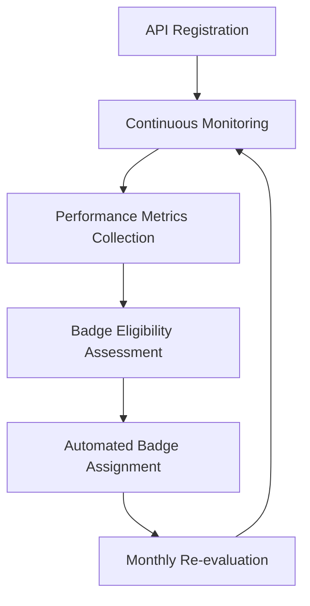

# # API Performance Badges System
**Revolutionizing API Marketplace Trust Through Automated Performance Certification**


---

## 📋 **Executive Summary**

The API Performance Badges System is an innovative solution designed to transform API marketplaces by introducing **automated, objective performance certification**. This system addresses the critical challenge of API reliability assessment in large-scale marketplaces like Rapid API (Nokia).

**Key Innovation**: Replace subjective popularity metrics with measurable, real-time performance indicators that drive both user confidence and provider quality improvements.

---

## 🎯 **Problem Statement**

### Current API Marketplace Challenges
- **Trust Deficit**: 4M+ developers struggle to identify reliable APIs among 40K+ options
- **Quality Opacity**: No standardized, objective quality indicators beyond popularity
- **Risk Assessment**: Developers can't easily evaluate API reliability before integration
- **Provider Motivation Gap**: Limited incentives for API providers to maintain high standards

### Market Impact
- **Developer Productivity Loss**: Hours spent evaluating unreliable APIs
- **Integration Failures**: Costly production issues from poor API choices  
- **Marketplace Differentiation**: Platforms compete primarily on quantity, not quality
- **Revenue Inefficiency**: High-quality APIs don't receive proportional visibility/revenue

---

## 💡 **Solution Overview**

### Automated Performance Badge System

A real-time certification engine that awards performance badges based on measurable, objective criteria:

#### 🏆 **Core Badge Categories**

**RELIABILITY**
- 🟢 **Trusted API**: 99%+ uptime (verified monthly)
- 🛡️ **Enterprise Ready**: 99.9%+ uptime + SLA guarantees
- 🔄 **Always Online**: 99.99%+ uptime (mission-critical grade)

**PERFORMANCE** 
- ⚡ **Lightning Fast**: <100ms average response time
- 🚀 **Blazing Speed**: <50ms average response time  
- 📊 **High Volume Ready**: >10K requests/minute capacity

**ADOPTION**
- 👥 **Community Proven**: >1K active monthly users
- 🌍 **Globally Adopted**: >10K active monthly users
- 📈 **Trending**: Top 10% growth month-over-month

**SECURITY**
- 🔒 **Security Certified**: Passed automated security scan
- 🏥 **Compliance Ready**: GDPR/HIPAA verified
- 🔐 **Zero Incidents**: No security issues in last 6 months

### 🔄 **Automated Verification Process**



---

## 📊 **Technical Implementation**

### Core Components

#### 1. **Real-Time Monitoring Engine**
```python
class APIMonitor:
    def collect_metrics(self, api_endpoint):
        return {
            'uptime': self.measure_availability(),
            'response_time': self.measure_latency(),
            'error_rate': self.analyze_error_patterns(),
            'throughput': self.measure_capacity(),
            'security_score': self.run_security_scan()
        }
```

#### 2. **Badge Calculation Algorithm**
```python
class BadgeEngine:
    def evaluate_badges(self, metrics, historical_data):
        badges = []
        
        # Reliability badges
        if metrics['uptime'] >= 0.99:
            badges.append('trusted_api')
        if metrics['uptime'] >= 0.999:
            badges.append('enterprise_ready')
            
        # Performance badges
        if metrics['response_time'] < 100:
            badges.append('lightning_fast')
        if metrics['response_time'] < 50:
            badges.append('blazing_speed')
            
        return badges
```

#### 3. **Integration Architecture**
- **Marketplace Integration**: Seamless badge display in search results
- **API Provider Dashboard**: Real-time performance insights
- **Developer Interface**: Badge-based filtering and sorting
- **Analytics Engine**: Badge impact tracking and ROI measurement

---

## 💰 **Business Model**

### Revenue Generation Strategy

**Performance-Based Commission Scaling**:
```
Standard APIs (no badges):     20% commission
Single Badge APIs:             22% commission  
Multi-Badge APIs (2-3):        25% commission
Premium Certified (4+ badges): 30% commission
```

### Revenue Distribution
- **Marketplace Platform**: 70% of additional revenue
- **System Provider**: 30% of additional revenue
- **API Provider**: Benefits from increased visibility and usage

### ROI Projections
- **Month 1-3**: MVP development and testing
- **Month 4-6**: Badge system deployment and adoption
- **Month 7+**: Positive ROI from increased API consumption

---

## 📈 **Market Opportunity**

### Target Market Size
- **API Management Market**: $5.1B globally (2024)
- **Rapid API Platform**: 4M+ developers, 40K+ APIs
- **Quality Certification Gap**: No existing standardized solution

### Competitive Advantage
- **First-Mover**: No existing automated API certification system
- **Objective Metrics**: Data-driven vs. subjective assessment
- **Platform Agnostic**: Adaptable to any API marketplace
- **Automated Scale**: No manual review bottlenecks

### Success Benchmarks (Based on App Store Badge Systems)
- **40%+ increase** in certified API adoption
- **25%+ increase** in revenue per certified API  
- **60%+ developer satisfaction** improvement for certified APIs

---

## 🚀 **Implementation Roadmap**

### Phase 1: MVP (Months 1-3)
- [ ] Core monitoring infrastructure
- [ ] Basic badge system (3 essential badges)
- [ ] Integration with top 100 APIs
- [ ] Developer feedback collection

### Phase 2: Scale (Months 4-6) 
- [ ] Full badge system deployment (8-10 badges)
- [ ] Advanced filtering and search integration
- [ ] Provider dashboard and analytics
- [ ] Marketplace-wide rollout

### Phase 3: Premium (Months 7-12)
- [ ] Enterprise certification program
- [ ] Custom badge categories
- [ ] White-label solution for other platforms
- [ ] Advanced analytics and insights

---

## 📊 **Success Metrics**

### Key Performance Indicators
- **Badge Adoption Rate**: % of APIs earning badges
- **Developer Engagement**: Badge-filtered searches vs. total searches
- **Revenue Impact**: Commission increase from badged APIs
- **Quality Improvement**: Platform-wide uptime and performance trends
- **Provider Satisfaction**: Survey scores from API providers

### Expected Outcomes
```
Month 3:  500+ APIs badged, 15%+ engagement with badge filters
Month 6:  2000+ APIs badged, 35%+ revenue from badged APIs  
Month 12: 5000+ APIs badged, industry-standard certification system
```

---

## 🔧 **Technical Requirements**

### Infrastructure
- **Monitoring System**: Global distributed monitoring network
- **Data Storage**: Time-series database for performance metrics
- **Analytics Engine**: Real-time badge calculation and updates
- **API Integration**: Marketplace platform integration points

### Security & Compliance
- **Data Privacy**: GDPR-compliant metrics collection
- **Security Standards**: SOC 2 Type II certification
- **Reliability**: 99.9% system uptime guarantee
- **Scalability**: Support for 100K+ API monitoring

---

## 💡 **Innovation Highlights**

### Unique Value Propositions
1. **Automated Objectivity**: No human bias in certification
2. **Real-Time Updates**: Badges reflect current performance
3. **Gamification**: Motivates continuous quality improvement  
4. **Market Transparency**: Clear quality signals for all stakeholders
5. **Scalable Architecture**: Grows with marketplace expansion

### Patent Considerations
- **Badge Calculation Algorithms**: Proprietary performance scoring
- **Real-Time Certification Engine**: Automated quality assessment system
- **Performance-Based Revenue Model**: Commission scaling based on objective metrics

---

## 📞 **Partnership Opportunities**

### Ideal Marketplace Partners
- **Rapid API (Nokia)**: Primary target - largest API marketplace
- **AWS API Gateway**: Enterprise-focused implementation
- **Google Cloud APIs**: Developer-centric deployment
- **Azure API Management**: Enterprise integration
- **Postman API Network**: Developer tools ecosystem

### Implementation Models
- **Direct Integration**: Platform-native badge system
- **White-Label Solution**: Customizable for different marketplaces
- **API-as-a-Service**: Standalone certification service
- **Consulting Partnership**: Implementation and optimization services

---

## 📈 **Next Steps**

### Immediate Actions (Week 1-2)
1. **Market Research**: Validate assumptions with API developers and providers
2. **Technical Proof of Concept**: Build minimal monitoring and badge system
3. **Partnership Outreach**: Initial conversations with target marketplaces
4. **Legal Protection**: File provisional patents for core innovations

### Short-term Goals (Month 1-3)
1. **MVP Development**: Functional badge system with core metrics
2. **Pilot Program**: Test with select API providers
3. **Partnership Negotiations**: Secure initial marketplace partnership
4. **Funding Strategy**: Seed funding or strategic partnership investment

---

## 📚 **Documentation & Resources**

### Technical Documentation
- API Monitoring Architecture
- Badge Calculation Algorithms  
- Marketplace Integration Guides
- Performance Benchmarking Standards

### Business Resources
- Market Analysis and Projections
- Competitive Landscape Assessment
- Partnership Proposal Templates
- Revenue Model Calculations

---

## 📄 **Legal & Intellectual Property**

### Concept Protection
- **Creation Date**: December 15, 2024
- **Creator**: Anzize Daouda
- **Patent Strategy**: Provisional applications for core algorithms
- **Trade Secrets**: Specific performance calculation methods

### Open Source Components
- Community contribution guidelines
- Public API for badge verification
- Developer tools and integrations
- Performance benchmarking datasets

---

## 🤝 **Contributing**

This concept is currently in development phase. For collaboration opportunities or partnership discussions, please reach out through appropriate channels.

### Contact Information
- **Repository**: [This GitHub Repository]
- **Documentation**: See `/docs` folder for detailed specifications
- **Issues**: Use GitHub Issues for technical discussions
- **Discussions**: Use GitHub Discussions for strategic conversations

---

## 📊 **Appendix: Market Data**

### API Marketplace Statistics (2024)
- **Global API Calls**: 1+ trillion annually
- **Developer Growth**: 25%+ year-over-year
- **Quality Concerns**: #1 barrier to API adoption
- **Trust Indicators**: Most requested feature by developers

### Competitive Analysis
- **Current Solutions**: Manual reviews, basic uptime monitoring
- **Gap Identified**: No comprehensive, automated certification
- **Market Opportunity**: $500M+ addressable market
- **Timeline Advantage**: 18-24 month first-mover window

---

**© 2024 Anzize Daouda. Concept and Implementation Strategy.**

*This document represents a strategic concept for revolutionizing API marketplace trust through automated performance certification. All technical specifications, business models, and implementation strategies are proprietary and subject to intellectual property protection.*
